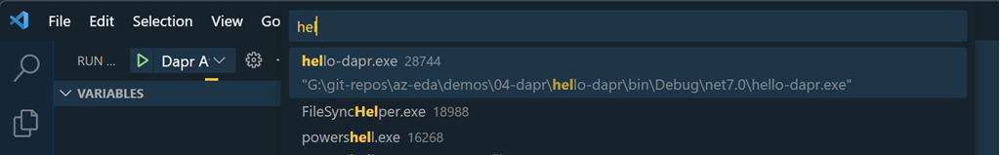

# Distributed Application Runtime - dapr

[Dapr - Visual Studio Code Extension](https://marketplace.visualstudio.com/items?itemName=ms-azuretools.vscode-dapr)

[Tye - Visual Studio Code Extension](https://marketplace.visualstudio.com/items?itemName=ms-azuretools.vscode-tye)

## Hello Dapr Intro

Install Dapr CLI

```
Set-ExecutionPolicy RemoteSigned -scope CurrentUser
powershell -Command "iwr -useb https://raw.githubusercontent.com/dapr/cli/master/install/install.ps1 | iex"
```

Initialize self-hosted Dapr

```
dapr init
```

Run Project

```
dapr run --app-id hello-dapr --app-port 5001 --dapr-http-port 5010 dotnet run
```

Show Dapr Dashboard

```
dapr dashboard
``` 

Examine Dapr Dashboard on:

```
http://localhost:8080
```


Examin Dapr Debug Attach Config in `launch.json`:

```json
{
    "name": "Dapr Attach",
    "type": "coreclr",
    "request": "attach",
    "processId": "${command:pickProcess}"
}
```

Lauchn `Dapr Attach` Config and filter for the hello-world process.



Install [Tye](https://github.com/dotnet/tye/). Project Tye is an experimental developer tool that makes developing, testing, and deploying microservices and distributed applications easier

```
dotnet tool install -g Microsoft.Tye --version "0.11.0-alpha.22111.1"
```