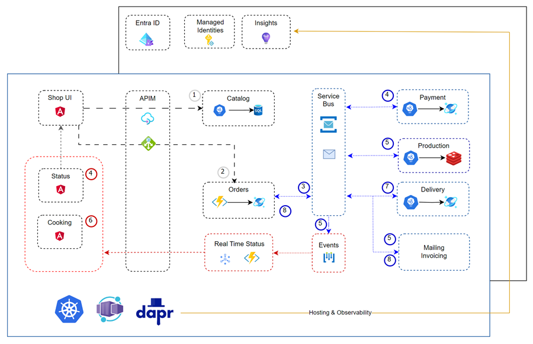

# Food App - A food delivery application

## Food Shop UI

A simple Angular UI to order food. It is a static web app that uses the Food Catalog API to retrieve the food catalog and the Food Order API to place orders.

## Food Catalog Api

An API that returns a list of food items from a relational SQL Server database. It cloud also be implemented using a NoSQL database like Cosmos DB, but for the sake of simplicity we are using a relational database.

## Food Order Api

An API that places orders that are stored in a Cosmos DB. Later on we will upgrade this API to implement a Saga Pattern to handle distributed transactions.

## Food Payments Api

An Api that picks up orders from a Service Bus and processes them. When the payment is processed it sends a message to a Service Bus topic to notify the Food Order Api that the payment was processed.

## Kitchen Dashboard

An Angular standalone app that displays the orders that were placed and paid in real time. It is implemented as Progressive Web App (PWA) and is used in the kitchen to guide the cooking process. When preparation is done the order is marked as ready and the delivery service is notified.

It uses `Kitchen Dashboard Function` to implement the real time functionality.

## Food Delivery Api

An Api that picks up prepared food orders from a Service Bus and delivers them. When the delivery is done it sends a message to a Service Bus to notify that the delivery was done.

## Graph Mail Daemon

A daemon that sends notification e-mails to confirm orders after they are placed and paid, and sends the final invoice after the delivery is done. It uses the Microsoft Graph API to send e-mails. In real life one could also use SendGrid or other e-mail service.Microsoft Graph.

# App Resources & Setup

- Create the base resources of the app by executing the following Azure CLI script: [create-images.azcli](/app/create-images.azcli). It creates the following resources:

    - resource group
    - key vault
    - managed identity
    - container registry
    - container app environment
    - storage account

- To create the container images execute: [create-images.azcli](/app/create-images.azcli)    