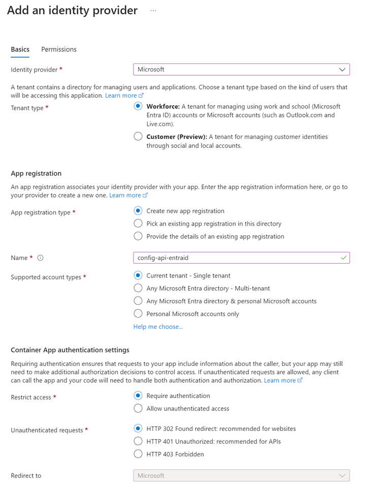
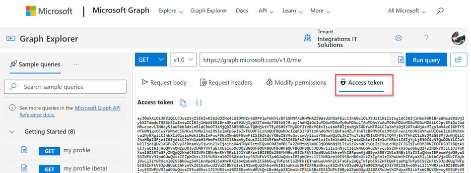

# Integrating Entra ID Authentication 

## Links & Resources

[Authentication and authorization in Azure Container Apps](https://learn.microsoft.com/en-us/azure/container-apps/authentication)

## Demo

- Query catalog service using `test-auth.http`
- Enable Entra ID Authentication on catalog service.

    

    >Note: If you create the app registration manually, make sure to consent to the required scopes before testing.

- An easy way to test the authentication is to get a token using [Graph Explorer](https://developer.microsoft.com/en-us/graph/graph-explorer) and attach it to your `http-request`.

    

- Test again by attaching a token from your own Entra ID

    ```bash
    @user="alexander.pajer@integrations.at"

    # @name authResponse
    POST https://login.microsoftonline.com/{{tenantId}}/oauth2/v2.0/token HTTP/1.1
    Content-type: application/x-www-form-urlencoded

    grant_type=client_credentials
    &client_id={{clientId}}
    &client_secret={{clientSecret}}
    &scope={{scope}}

    ### test api
    GET https://config-api.salmonsea-9df74ebc.westeurope.azurecontainerapps.io/food HTTP/1.1
    Authorization: Bearer {{authResponse.response.body.access_token}}
    Content-Type: application/json
    ```

    >Note: This requires that an App Registration for REST Client was created. Please find a guide [here](../../../tooling/07-rest-client/)
