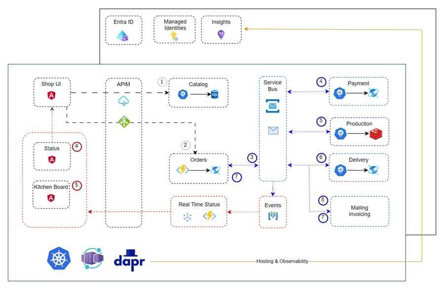

# Domain Driven Design and NoSQL

## Links & Resources

[The Bounded Context Canvas](https://github.com/ddd-crew/bounded-context-canvas)

[Domain Message Flow Modelling](https://github.com/ddd-crew/domain-message-flow-modelling)

## Demo:

Based on our architecture diagram we will now implement the Food App using Domain Driven Design and a NoSQL database.

