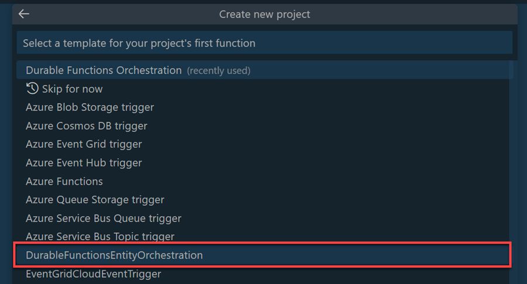

# Azure Durable Entities & Actors

[Entity Functions](https://learn.microsoft.com/en-us/azure/azure-functions/durable/durable-functions-entities?tabs=csharp)

## Demo

>Note: The project was scaffolded using the following command:

https://techcommunity.microsoft.com/t5/apps-on-azure-blog/a-walkthrough-of-durable-entities/ba-p/3616832

https://learn.microsoft.com/en-us/azure/azure-functions/durable/durable-functions-entities?tabs=csharp#comparison-with-virtual-actors

https://github.com/Azure/azure-functions-durable-extension/tree/dev/samples/entitites-csharp/Chirper
