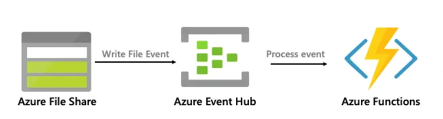
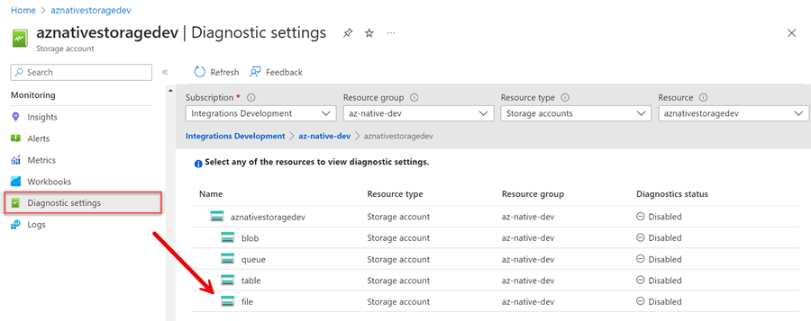
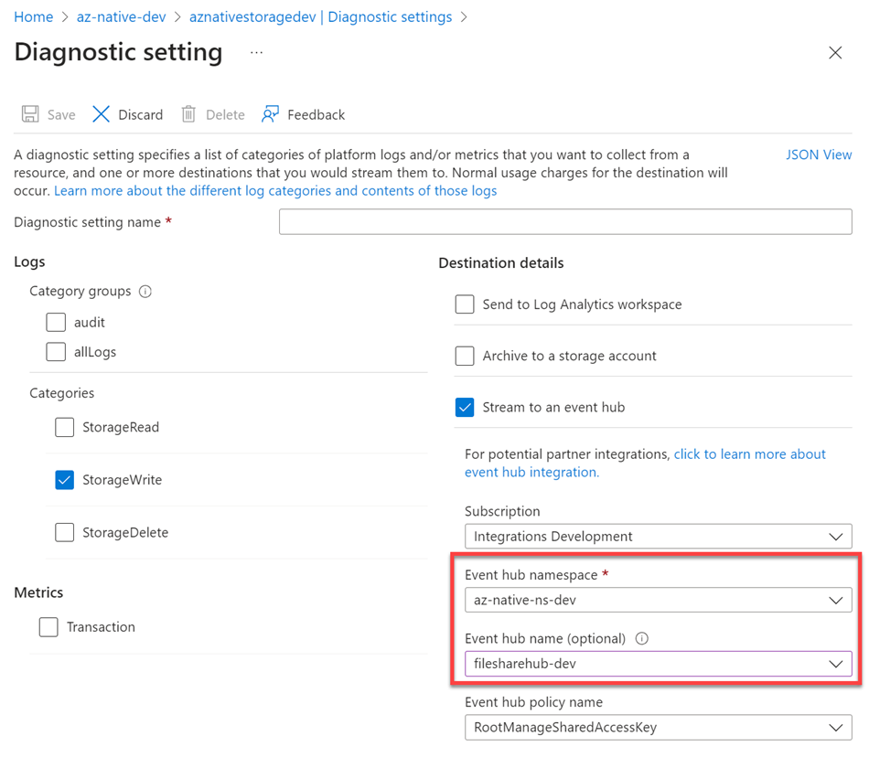
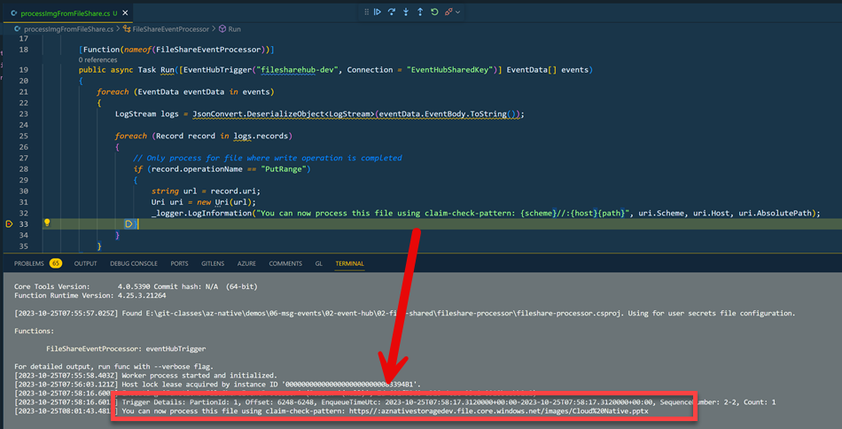

# Collect Events from Azure Storage File Share in Event Hub

In this demo, we will collect events from Azure Storage File Share in Event Hub. As Azure File Share does not publish events to event grid, we will use 

## Demos

- Execute `capture-fileShare-events.azcli` to create the Event Hub and the storage account

- Go to the diagnostic settings of storage account and edit the settings for file share events

    

- Send this events to the Event Hub created in the previous step

    

- Run the demo and watch the output in the debugger. You should see the events from the file share

        

    >Note: You could now process this file using the [Claim-Check-pattern](https://learn.microsoft.com/en-us/azure/architecture/patterns/claim-check)