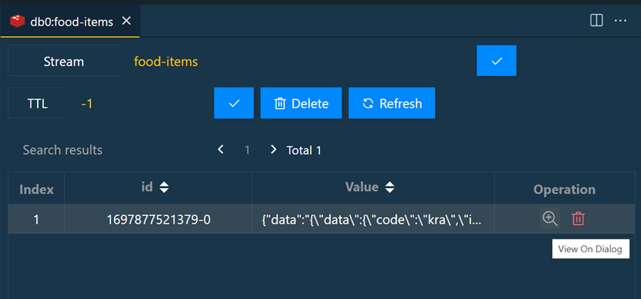
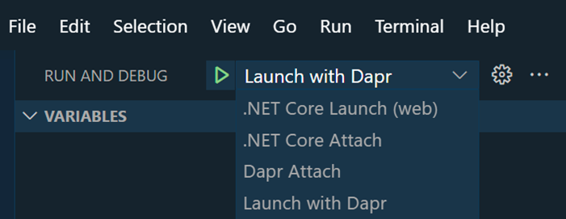

# Developer Environment Setup & Debugging 

## Links & Resources

[Dapr Overview](https://docs.dapr.io/concepts/overview/)

[Dapr Components Reference](https://docs.dapr.io/reference/components-reference/)

[Dapr CLI](https://docs.dapr.io/reference/cli/cli-overview/)

[Developing Dapr applications with Dev Containers](https://docs.dapr.io/developing-applications/local-development/ides/vscode/vscode-remote-dev-containers/)

## Tools and Extensions

[Dapr - Visual Studio Code Extension](https://marketplace.visualstudio.com/items?itemName=ms-azuretools.vscode-dapr)

[Tye - Visual Studio Code Extension](https://marketplace.visualstudio.com/items?itemName=ms-azuretools.vscode-tye)

## Getting started, Basic State & Deployment to Azure Container Apps

### Dapr Environment Setup & Debugging

- Install Dapr CLI

    ```powershell
    Set-ExecutionPolicy RemoteSigned -scope CurrentUser
    powershell -Command "iwr -useb https://raw.githubusercontent.com/dapr/cli/master/install/install.ps1 | iex"
    ```

    >Note: Restart the terminal after installing the Dapr CLI

- Install the [Dapr Visual Studio Code extension](https://docs.dapr.io/developing-applications/local-development/ides/vscode/vscode-dapr-extension/)    

- Initialize default Dapr containers and check running containers:

    ```bash
    dapr init
    ```

    >Note: In case you need to remove the default Dapr containers run `dapr uninstall` 

- Check the running containers using the [Docker Visual Studio Code Extension](https://marketplace.visualstudio.com/items?itemName=ms-azuretools.vscode-docker)

    

- Run project [food-service-dapr](../00-app/food-service-dapr/)

    ```bash
    dapr run --app-id food-api --app-port 5000 --dapr-http-port 5010 --resources-path './components' dotnet run
    ```

    >Note: By default the --app-port is launching the https-profile from launchSettings.json. With .NET 7+ you can choose the profile by using the `--launch-profile` parameter.

- Test the API by invoking it several times using the dapr sidecar. The sidecar that listens to port `5010` forwards the request to the app. The sidecar is also responsible for service discovery and pub/sub.

    ```bash
    GET http://localhost/<dapr-http-port>/v1.0/invoke/<app-id>/method/<method-name>
    GET http://localhost:5010/v1.0/invoke/food-api/method/food
    ```

    >Note: You can use the [Redis Visual Studio Code Extension](https://marketplace.visualstudio.com/items?itemName=cweijan.vscode-redis-client) to connect to the Redis instance and check the data in the state store.

    

- Run project `food-mvc-dapr`

    ```bash
    cd food--mvc-dapr
    dapr run --app-id food-fronted --app-port 5002 --dapr-http-port 5020 --resources-path './components' dotnet run
    ```    

- Show Dapr Dashboard

    ```
    dapr dashboard
    ``` 

- Examine Dapr Dashboard on http://localhost:8080:

    


### Debugging Dapr Apps

- Setup for Dapr Debugging can be done using the Dapr Extension for Visual Studio Code. 

    

    >Note: Make sure you have setup .NET debugging in advance

- Test your debug configuration

    

### Running multiple Dapr Apps with Tye

- Install [Tye](https://github.com/dotnet/tye/). Project Tye is an experimental developer tool that makes developing, testing, and deploying microservices and distributed applications easier

    ```
    dotnet tool install -g Microsoft.Tye --version "0.11.0-alpha.22111.1"
    ```

- Install the [Tye Visual Studio Code Extension](https://marketplace.visualstudio.com/items?itemName=ms-azuretools.vscode-tye)    

- Create a [tye.yaml](../00-app/tye.yaml) file in the root of the solution by running:

    ```    
    tye init
    ```

    >Note: You can skip this step as the `tye.yaml` file is already included in the solution.    

- A typical tye file could look like this:

    ```yaml
    name: dapr-services
    services:
    - name: food-api-dapr
    project: food-api-dapr/food-api-dapr.csproj
    bindings:
    - port: 5001  
    - name: food-mvc-dapr
    project: food-mvc-dapr/food-mvc-dapr.csproj
    bindings:
    - port: 5002
    - name: food-invoices-dapr
    project: food-invoices-dapr/food-invoices-dapr.csproj
    bindings:
    - port: 5003
    ```

- Run multiple projects with Tye

    ```
    tye run
    ```    
- Check Tye Dashboard on http://localhost:8000:

        
