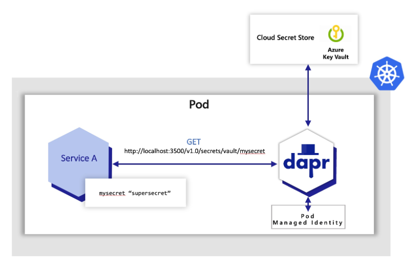

# Secrets and Configuration

- Dapr Secrets Store and Azure Key Vault
- Dapr Configuration Store and Azure App Configuration

## Links & Resources

[Dapr Secret Stores](https://docs.dapr.io/reference/components-reference/supported-secret-stores/)

[Dapr Configuration Stores](https://docs.dapr.io/reference/components-reference/supported-configuration-stores/)

[The Dapr secrets management building block](https://learn.microsoft.com/en-us/dotnet/architecture/dapr-for-net-developers/secrets-management)

[Azure App Configuration configuration store component](https://docs.dapr.io/reference/components-reference/supported-configuration-stores/azure-appconfig-configuration-store/)

## Using Dapr Secrets Store and Azure Key Vault

Dapr’s dedicated secrets building block API makes it easier for developers to consume application secrets from a secret store. 



- Execute [create-secrets-config-app.azcli](create-secrets-config-app.azcli) to create a Key Vault, the App Configuration Service and a secret in Azure Key Vault.

- Create an Entra ID App Registration an assign the following permissions:

    - Azure Key Vault: `Get` and `List` permissions

- Start the Dapr sidecar and the [food-api-dapr](../00-app/food-api-dapr/) application using the following command:

    ```bash
    dapr run --app-id food-api --app-port 5000 --dapr-http-port 5010 --resources-path './components' dotnet run
    ```

- Examine `secretstore.yaml`. 

    ```yaml
    apiVersion: dapr.io/v1alpha1
    kind: Component
    metadata:
    name: azure-keyvault
    spec:
    type: secretstores.azure.keyvault
    version: v1
    metadata:
    - name: vaultName
        value: "az-native-kv-dev"
    - name: azureTenantId
        value: ""
    - name: azureClientId
        value: ""
    - name: azureClientSecret
        value: ""
    ```

- Examine [KeyVaultController.cs](../00-app/food-service-dapr/Controllers/KeyVaultController.cs) and the `GetSecret()` method:

    ```c#    
    [HttpGet("getSecret")]
    public async Task<string> Get(string secretName)
    {
        HttpClient client = new HttpClient();
        var daprResponse = await client.GetAsync($"http://localhost:5010/v1.0/secrets/azurekeyvault/{secretName}");
        var secretJson = await daprResponse.Content.ReadAsStringAsync();
        return JObject.Parse(secretJson)[secretName].ToString();
    }
    ```

- Test using:

    ```
    GET {{baseUrl}}/keyvault/getsecret?secretName=dapr-secret
    content-type: application/json
    ```

## Using Dapr Configuration Store and Azure App Configuration

Dapr’s dedicated configuration building block API makes it easier for developers to consume application configuration from a configuration store.

```yaml
apiVersion: dapr.io/v1alpha1
kind: Component
metadata:
name: azureappconfig
spec:
type: configuration.azure.appconfig
version: v1
metadata:
- name: host 
    value: <HOST>
- name: connectionString 
    value: <CONNECTIONSTRING>
```