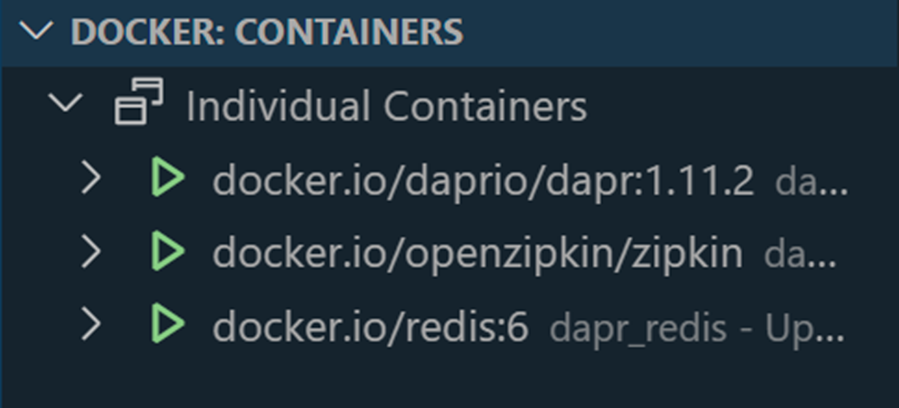

# Dapr Environment Setup, Tooling & State Management

This sample introduces on how to code & debug a Dapr based microservices and deploy it to Azure Container Apps. It is based on the [Dapr quickstarts](https://docs.dapr.io/getting-started/quickstarts/). 

It contains two projects:

- `food-dapr-backend` - A .NET Core Web API project that uses State Management to store and retrieve state. in a other demos it will be used to demonstrate features like Secrets, Publish & Subscribe as well as Observability and Distributed tracing. 
- `food-dapr-frontend` - A .NET MVC project that consumes the backend.

Configuration of of [Dapr components](https://docs.dapr.io/concepts/components-concept/) is stored in the [./components](components) folder. During development it will use `Redis` as the default state store. When deploying it will use Azure Blob Storage. We could also use Azure Cosmos DB as a state store just by changing the state store configuration.

- `statestore.yaml` - Configures the state store to use Azure Blob Storage.

    ```yaml
    componentType: state.azure.blobstorage
    version: v1
    metadata:
    - name: accountName
    value: aznativedev
    - name: accountKey
    value: account-key
    - name: containerName
    value: food-dapr-backend
    secrets:
    - name: account-key
    value: "<ACCOUNT_KEY>"
    ```

    


## Docs & Resources

[Dapr Overview](https://docs.dapr.io/concepts/overview/)

[Dapr CLI](https://docs.dapr.io/reference/cli/cli-overview/)

[Dapr Visual Studio Code extension](https://docs.dapr.io/developing-applications/local-development/ides/vscode/vscode-dapr-extension/)

[Developing Dapr applications with Dev Containers](https://docs.dapr.io/developing-applications/local-development/ides/vscode/vscode-remote-dev-containers/)

[Dapr on YouTube](https://www.youtube.com/channel/UCtpSQ9BLB_3EXdWAUQYwnRA)

## Getting started, Basic State & Deployment to Azure Container Apps

>Note: This demo assumes that you have created an Azure Container Regestry and Azure Container Apps environment. If you haven't done so, please follow the [instructions](/demos/04-azure-container-apps/01-basics/create-aca-env.azcli) to provision the required Azure Ressources using [Azure CLI]() or [Bicep]().

### Dapr Environment Setup & Debugging

- Install Dapr CLI

    ```
    Set-ExecutionPolicy RemoteSigned -scope CurrentUser
    powershell -Command "iwr -useb https://raw.githubusercontent.com/dapr/cli/master/install/install.ps1 | iex"
    ```

    >Note: Restart the terminal after installing the Dapr CLI

- Initialize default Dapr containers and check running containers:

    ```bash
    dapr init
    ```

    

   >Note: To remove the default Dapr containers run `dapr uninstall` 

- Run project `food-dapr-backend`

    ```
    cd food-dapr-backend
    dapr run --app-id food-backend --app-port 5001 --dapr-http-port 5010 dotnet run --launch-profile https
    ```

- Test the API by invoking `http://localhost:5000/food` several times using the dapr sidecar. The sidecar is listening on port `5010` and the app is listening on port `5000`. The sidecar that listens to port `5010` forwards the request to the app. The sidecar is also responsible for service discovery and pub/sub.

    ```bash
    GET http://localhost/<dapr-http-port>/v1.0/invoke/<app-id>/method/<method-name>
    GET http://localhost:5010/v1.0/invoke/food-backend/method/food
    ```

- Run project `food-dapr-fronted`

    ```
    cd food-dapr-fronted
    dapr run --app-id food-fronted --app-port 5002 --dapr-http-port 5011 dotnet run
    ```    

- Show Dapr Dashboard

    ```
    dapr dashboard
    ``` 

- Examine Dapr Dashboard on http://localhost:8080:

    

### Running multiple microservices with Tye

- Install [Tye](https://github.com/dotnet/tye/). Project Tye is an experimental developer tool that makes developing, testing, and deploying microservices and distributed applications easier

    ```
    dotnet tool install -g Microsoft.Tye --version "0.11.0-alpha.22111.1"
    ```

- Create a `tye.yaml` file in the root of the solution by running:

    ```    
    tye init
    ```

    >Note: You can skip this step as the `tye.yaml` file is already included in the solution.    

- A typical tye file could look like this:

    ```yaml
    name: dapr-services
    services:
    - name: food-dapr-backend
    project: food-dapr-backend/food-dapr-backend.csproj
    bindings:
    - port: 5000
    - name: food-dapr-frontend
    project: food-dapr-frontend/food-dapr-frontend.csproj
    bindings:
    - port: 5002
    ```

- Run the two projects with Tye

    ```
    tye run
    ```    

    

### Using Default State Store

- Add DaprClient to `Program.cs`

    ```c#
    var builder = WebApplication.CreateBuilder(args);
    ...
    // Add DaprClient to the ioc container
    builder.Services.AddDaprClient();
    ```
- Examine `CountController.cs` and call `getCount()` multiple times to increment the counter and receive its current value:

    ```c#
    public CountController(DaprClient daprClient)
    {
        client = daprClient;
    }

    [HttpGet("getCount")]
    public async Task<int> Get()
    {
        var counter = await client.GetStateAsync<int>(storeName, key);
        await client.SaveStateAsync(storeName, key, counter + 1);
        return counter;
    }
    ```

- To increment the counter you can use the pre-configured REST calls in [test-backend.http](./food-dapr-backend/test-backend.http) which is using the [Rest Client for Visual Studio Code Extension](https://marketplace.visualstudio.com/items?itemName=humao.rest-client).      

    ```bash
    @baseUrl = http://localhost:5000
    ### Get the count and icrement it by 1
    GET {{baseUrl}}/count/getcount HTTP/1.1
    ```

- Check the state store data in the default state store - Redis:

    ```bash
    dapr state list --store-name statestore
    ```   

- Examine the `Dapr Attach` config in `launch.json` and use it to attach the debugger to the `food-dapr-backend` process and debug the state store code:

    ```json
    {
        "name": "Dapr Attach",
        "type": "coreclr",
        "request": "attach",
        "processId": "${command:pickProcess}"
    }
    ```
    

### Deploy to Azure Container Apps

- Build the food-dapr-backend image

    ```bash
    env=dev
    grp=az-native-$env
    loc=westeurope
    acr=aznative$env
    imgBackend=food-dapr-backend:v1
    az acr build --image $imgBackend --registry $acr --file dockerfile .
    ```
- Create a storage account to be used as state store

    ```bash
    stg=aznative$env
    az storage account create -n $stg -g $grp -l $loc --sku Standard_LRS
    ```

- Update its values in `components/statestore.yml`

    ```yaml
    apiVersion: dapr.io/v1alpha1
    kind: Component
    metadata:
    name: statestore
    spec:
    type: state.azure.blobstorage
    metadata:
        - name: storageAccount
        value: aznative$env
        - name: storageAccessKey
        value: <storage-account-key>
    ```        

- Add the Dapr component to the Azure Container Apps environment

    ```bash
    az containerapp env dapr-component set -n $acaenv -g $grp \
    --dapr-component-name statestore \
    --yaml './components/statestore.yml'
    ```    
    >Note. In Azure Portal you can also create the Dapr component in the Azure Container Apps environment. It allows you to choose between Redis, Azure Blob Storage, Azure Cosmos DB and others as a state store. The interaction with the specifics of the state store is abstracted away by Dapr:

    


- Execute deploy-app.azcli to create the container app

    ```bash
    az containerapp create -n $appBackend -g $grp \
    --image $imgBackend \
    --environment $acaenv \
    --target-port 80 --ingress external \
    --min-replicas 0 --max-replicas 1 \
    --enable-dapr \
    --dapr-app-port 80 \
    --dapr-app-id $appBackend \
    --registry-server $loginSrv \
    --registry-username $acr \
    --registry-password $pwd 
    ```

    >Note: Accessing ACR could also done using a managed identity. Check the [documentation](https://learn.microsoft.com/en-us/azure/container-apps/managed-identity-image-pull?tabs=azure-cli&pivots=command-line) for more details.

- Execute the /count/getCount method multiple times to increment the counter

    ```bash
    curl -X GET "http://<URL>.$loc.azurecontainer.io/count/getCount" -H  "accept: text/plain"
    ```

- Examine the storage account to see the state store data

    
