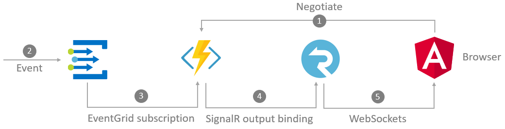
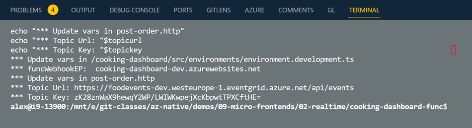
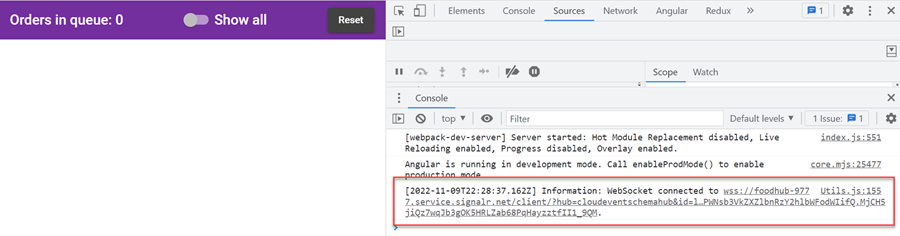

# Real-time connected Angular Micro Frontend using Azure Event Grid and SignalR

[Kitchen Dashboard](/app/web/cooking-dashboard/) implemented as Angular Micro-Frontend using `@ngrx/component-store` displaying orders.  [Kitchen dashboard function](/app/functions/cooking-dashboard-func/) that acts as an endpoint for the event grid topic webhook subscription and communicates with the SignalR service that provides a real time connection to the orders dashboard.



## Readings

[CloudEvent schema](https://docs.microsoft.com/en-us/azure/event-grid/cloudevents-schema)

[Understand event filtering for Event Grid subscriptions](https://learn.microsoft.com/en-us/azure/event-grid/event-filtering)

[Understand event domains for managing Event Grid topics](https://learn.microsoft.com/en-us/azure/event-grid/event-domains?tabs=event-grid-event-schema)

[SignalR](https://docs.microsoft.com/en-us/azure/azure-signalr)

## Demo

-   Execute `deploy-app.azcli`step-by-step to deploy the app.

-   Update SignalR config key `fxEndpoint` in `environment.ts` of `kitchen-dashboard` using the values from the terminal of the previous step.

    

    ```typescript
    export const environment = {
    funcWebhookEP: 'https://cooking-dashboard-dev.azurewebsites.net/api',
    };
    ```
- Install the npm packages of the cooking-dashboard by executing:

    ```bash
    npm i
    ```

-   Start the Micro-Frontend using `ng serve` in `cooking-dashboard` and open [http://localhost:4200](http://localhost:4200). Open the F12 Dev tools and check that the SignalR connection is established.

    

-   Send a mock CloudEvent using `post-order.http` by updating `@topicurl` and `@topickey` with the values from the terminal:

    ```
    @topicUrl=https://foodevents-dev.westeurope-1.eventgrid.azure.net/api/events
    @topicKey=<KEY>

    POST  https://{{topicUrl}}//api/events HTTP/1.1
    content-type: application/cloudevents+json; charset=utf-8
    aeg-sas-key: {{topicKey}}

    { ...
    ```
## Publish to Azure Container Apps

In order to publish the Shop UI to Azure Container Apps you have to implement the following steps:

- Build and Publish the docker image using Azure Container Registry

    ```bash
    az acr build --image cooking-dashboard --registry $acr --file dockerfile .
    ```

- Create a Container app with ingress enabled

    ```bash
    az containerapp create -n cooking-dashboard -g $grp \
        --image $acr.azurecr.io/cooking-dashboard \
        --environment $acaenv \
        --target-port 80 --ingress external \
        --registry-server $loginSrv \
        --registry-username $acr \
        --registry-password $pwd \
        --env-vars "ENV_FUNC_EP=$fxEndpoint/" \
        --query properties.configuration.ingress.fqdn -o tsv
    ```