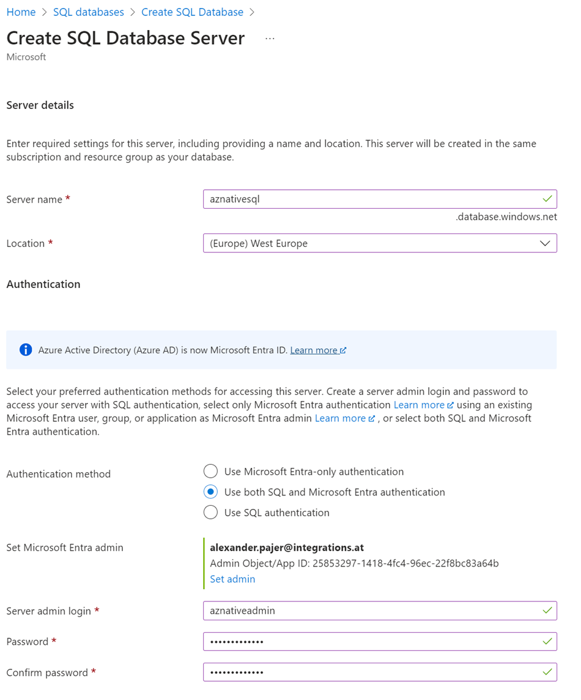
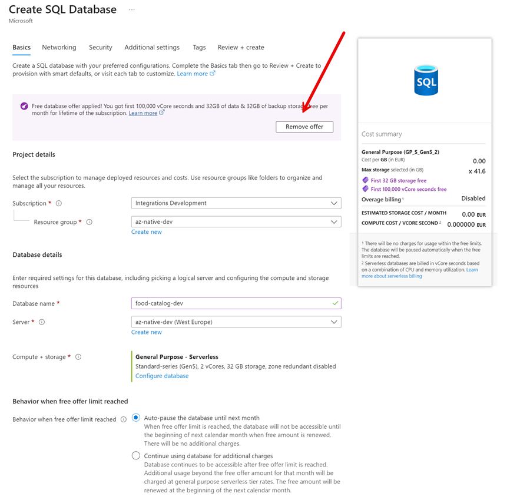
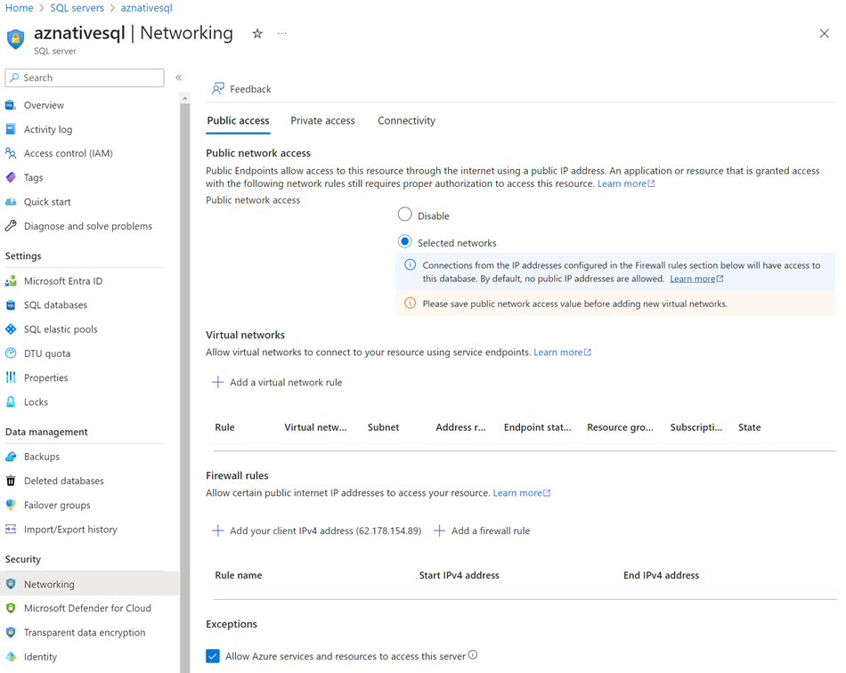
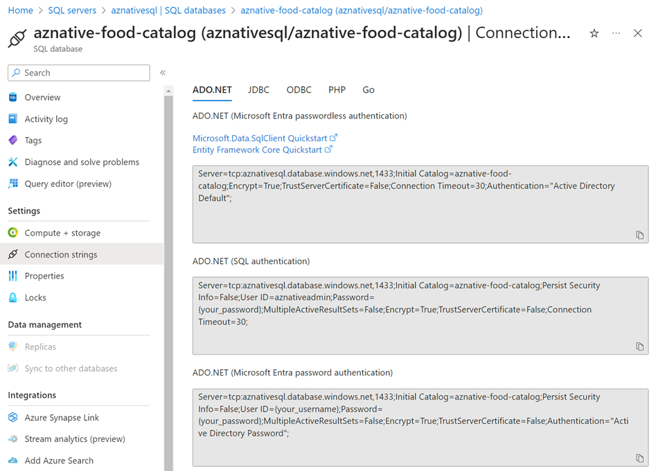

# Lab 02 - Container Essentials

In this Lab we will explore the basics of containers. We will start by containerizing the following apps:

- Catalog Api
- Orders Api
- Food Shop UI

## Task: Setup an Azure SQL Server and Database

>Note: We are not scripting this because at the moment there is no way to use the [new free Azure SQL tier](https://learn.microsoft.com/en-us/azure/azure-sql/database/free-offer?view=azuresql) using Azure CLI or Bicep.

- Create a new Azure SQL Server. Use a password that you can remember.

    
  
- Create a new Database

    

- Set the networking rules to allow you own ClientIP and Azure Services

     

- Get the connection string to your Database. You will need it later.

    

    >Note: Use the ADO.NET authentication. Microsoft Entry Password (-less) Authentication is documented [here](https://learn.microsoft.com/en-us/azure/azure-sql/database/authentication-aad-configure?view=azuresql&tabs=azure-powershell). In production this should be the preferred way to authenticate. When using .NET you will have to use the [Microsoft.Data.SqlClient](https://www.nuget.org/packages/Microsoft.Data.SqlClient) package instead of [System.Data.SqlClient](https://www.nuget.org/packages/System.Data.SqlClient/). Find more information [here](https://learn.microsoft.com/en-us/sql/connect/ado-net/sql/azure-active-directory-authentication?view=sql-server-ver16)

## Task: Containerizing the Catalog Api

- Add a docker file to Catalog Api build and test the container locally.
- Override values from appsettings.json using environment variables.
    - Set UseSQLite to false
    - Create a new Azure SQL Server & Azure SQL Database
    - Set the connection string to the new Azure SQL Database

    >Note: You can use the following module as a reference: 

    - [container build](/demos/02-containers/01-dev-workflow)    
    - [config management](/demos/02-containers/05-config-mgmt/)    
    
## Task: Containerizing the Food Shop UI

- Add a docker file to Shop UI build and test the container locally.
- Override values from appsettings.json using environment variables.
    - Set CatalogUrl to the Catalog Api container url
    - Set OrdersUrl to the Orders Api container url

## Task: Containerizing the Orders Api

- Add a docker file to Orders Api build and test the container locally.

## Task: Docker Compose

- Write a docker compose file to run the containers locally. Use the following [reference](/demos/02-containers/03-docker-dompose/docker-compose.yml)

## Task: Push to ACR

- Outsource the container build to ACR. Use the following [reference](/demos/02-containers/02-publish/publish-images.azcli)