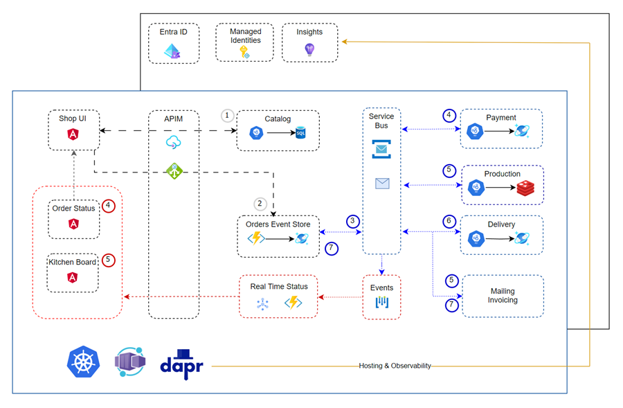
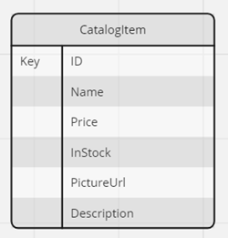
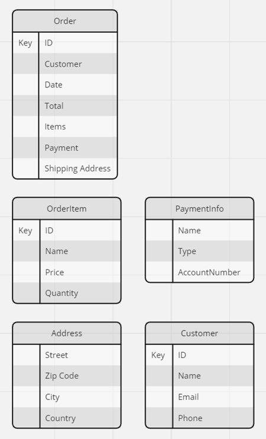
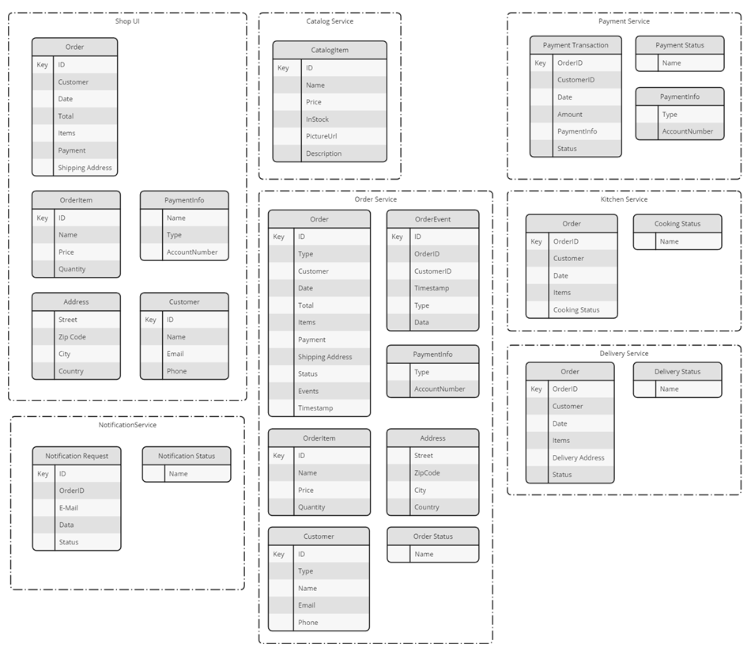
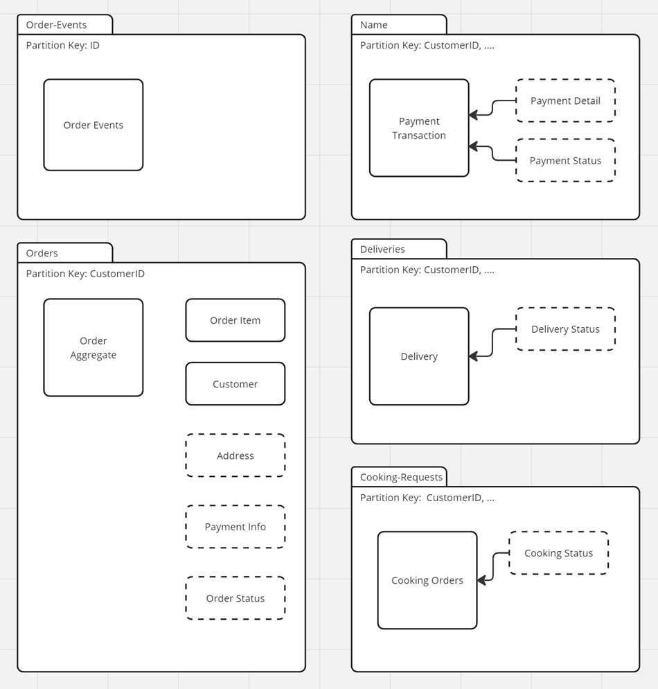

# Lab 05 - Domain Driven Design, NoSQL Data & Event storage using Cosmos DB

In this lab we will design our basic data model and keep aspects of Domain Driven Design in mind. 

We will use Azure SQL for the Catalog service, and Cosmos DB as our NoSQL database and event store for all other services. 

## Task: Domain Driven Design

- With the given Architecture diagram in mind, identify the entities, value objects and aggregates for the following services. We will discuss the results in class afterwards.

  - Catalog Service
  - Orders Service
  - Payment Service
  - Kitchen Service (Production)
  - Delivery Service
  
    

- Possible Solution:

  

## Task: Designing the Data Model

- `Catalog Service` has one main entity:

    

- `Food Shop UI` has the following entities and value objects:   

    

- Possible Solution:

   

## Task: Create & Deploy the Physical Design

- Use the Cosmos DB Account created in Lab 01 to create the containers for `food-app` in a `food-nosql-$env` database. To keep this simple we will use the same database for all services. In a real world scenario you would create a database for each service.

- Create the containers `orders` and `order-events` and chose a partition key. Use `IaC (Azure CLI or Bicep)` in order to be able to drop and recreate the containers easily.

- Possible Solution:

   

## Task: Event Sourcing & CQRS

- Open [order-service-cqrs](./solution/orders-service-cqrs/) in a new VS Code instance.

- Make sure you copied the correct settings to `appsettings.json`

- Examine `orders-api.csproj` and the referenced packages including MediatR.

- Examine Program.cs and the `IOrderAggregates`, `IOrderEventsStore` and `AddMediatR`. Also look at the implementation code of the interfaces.

- Examine OrdersController.cs and the injection of `ISender`.

- Examine the CQRS folder and the content of Queries and its Handlers. Try to understand its purpose.

- Examine the CQRS folder and the content of Commands and its Handlers. Try to understand its purpose.

- Start the app in F5 debug mode and use the provides `orders-tester.http` to submit an order.

- Check if the order event was stored in the `order-events` container.

- Open [order-event-processor](./solution/order-events-processor/) in a new VS Code instance.

- Make sure you copied the correct settings to `CosmosDBConnectionString`

- Examine `ProcessOrders.cs` and notice how it consumes the change feed from Cosmos DB. Notice how it creates the initial order in the `orders` container and then updates the order with the events from the `order-events` container.

## Task: Deploy Containerize Apps

- Go to the solution folder and run `create-images.azcli`

- Execute `deploy-app.azcli`. Deploy one app after the other and think how you could test the app after each deployment.

Examples:

- After deploying the catalog service, you can test the API using the Swagger UI.

- After deploying the order service use the REST Client to submit an order and check if it was stored in the database.

- After deploying the shop-ui you can submit an order using the UI. Again you can check if the order was stored in the database. Don't worry about the duplicate orders for now.

- After deploying the shop-ui you can submit an order using the UI. Again you can check if the order was stored in the database. Don't worry about the duplicate orders for now.

- Run the event processor on the local machine and submit another order. Check if the order was stored in the `orders` container.