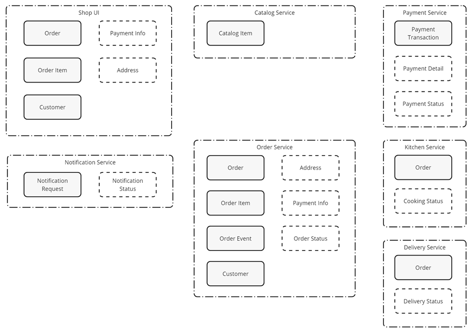
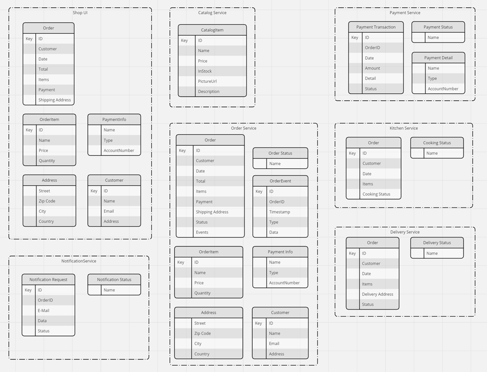

# Solution - Domain Driven Design, NoSQL Data & Event storage using Cosmos DB

## Architecture

## Task: Domain Driven Design

## Task: Designing the Data Model

## Task: Create the Physical Design

## Task: Deploy Containerize Apps

- Go to the solution folder and run `create-images.azcli`

- Execute `deploy-app.azcli`. Deploy one app after the other and think how you could test the app after each deployment.

Examples:

- After deploying the catalog service, you can test the API using the Swagger UI.

- After deploying the order service use the REST Client to submit an order and check if it was stored in the database.

- After deploying the shop-ui you can submit an order using the UI. Again you can check if the order was stored in the database. Don't worry about the duplicate orders for now.

- After deploying the shop-ui you can submit an order using the UI. Again you can check if the order was stored in the database. Don't worry about the duplicate orders for now.

- Run the event processor on the local machine and submit another order. Check if the order was stored in the `orders` container.