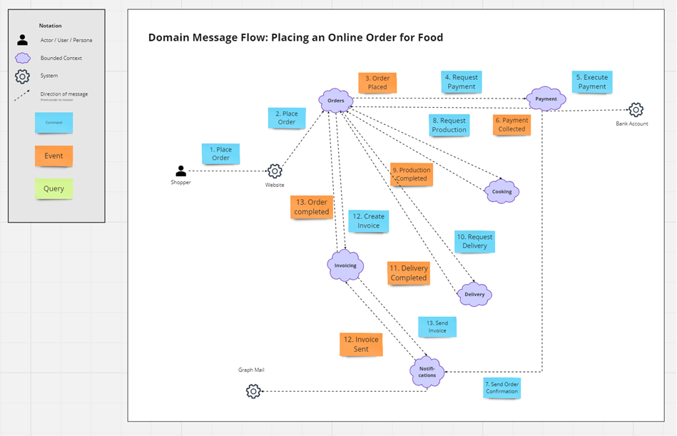
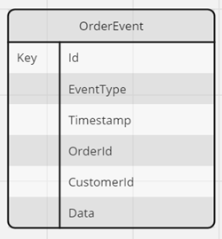
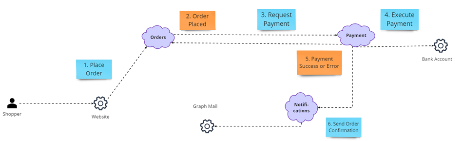

# Lab 06 - Designing and Implementing Message based & Event Driven Apps

In this lab we will take a look at the message flow between the services and design the message data structures. Most of the practical work will be done in the next lab as we will use Dapr to implement the message flow.

## Task: Examine the Domain Message Flow Model and Design the Message Data Structure

- Examine the `Food App Domain Message Flow Model`. 

    

- All messages / events will be wrapped in an `OrderEvent`. The OrderEvent will be used to route the messages to the correct service. When using `Dapr Pub/sub`, which will be introduced in the next module, the `OrderEvent` will be wrapped in a `CloudEvent` by Dapr.

    
    
    >Note: Although some messages can container fields like `OrderId` or `CustomerId` and might not be a required field in some services or represent duplicate fields, we include them in in the `OrderEvent` envelope to avoid costly lookups for the processing of response messages in other services which might require them.

- Design the data structures for the messages that will be exchanged between the services for the following commands and events:

    - PaymentRequest    
    - PaymentResponse: PaymentSuccess | PaymentFailed
    - CookingRequest
    - CookingResponse: CookingSuccess | CookingFailed
    - DeliveryRequest
    - DeliveryResponse: DeliverySuccess | DeliveryFailed
    - SendInvoiceRequest
    - SendInvoiceResponse: SendInvoiceSuccess | SendInvoiceFailed
    - OrderCompleted | OrderFailed

- You can use the [Miro - Entity Relationship Diagram Template](https://miro.com/templates/entity-relationship-diagram/) or some other tool or even a piece of paper.

- If you don't want to draw charts just implement the classes and the interfaces for the message flow in `C#` or `TypeScript` and document the message flow in the code. You can do this in a separate project or in plain markdown or a diagram tool of your choice.

## Task: Review the payment process

- Examine the payment process. We will use this process as a reference for the implementation of the message flow. Note that as a result of the payment process we might send an order confirmation / cancellation to the customer and might use a topic for this. We will not implement this in this lab but instead focus on the message flow between order service and payment service.

- To keep things simple we will integrate the bank account into the payment service. In a real world scenario we would consume a separate external service for this.

    

## Task: Provision the required infrastructure to connect Order Service to the Payment Service

- Create a container `cooking-service` with the partition key `/orderId` in the `food-nosql-$env` database in the `az-native-cosmos-nosql-$env` Cosmos DB account using IaC (Azure CLI or Bicep). We will store all incoming requests as the entities of the bounded context in this container. In a real world scenario you would create a database for each service and might have an advanced physical design with multiple containers for each service.

- Create a `payment-requests` and a `payment-response` queue in the `aznativesb$env` Service Bus namespace using IaC (Azure CLI or Bicep).

## Task: Implement the payment process

- Take the [Order Service CQRS](./starter/orders-service-cqrs/) from the previous lab and connect it to the `Payment Service` using Azure Service Bus and a queue. 
    - Implement the class for `PaymentRequest` messages.
    - Use the `OrdersController` to publish the event. 

- Take the [Payment Service](./starter/payment-service/) from module 04 as a starting point and implement the `Payment Service`. Do not implement the response messages yet. In the next lab we will use Dapr to implement the message flow and the response messages.

- Use [Visual Studio Code REST Client](https://marketplace.visualstudio.com/items?itemName=humao.rest-client) to test the `Order Service` and the `Payment Service`.

- If your time permits it you can also connect the [Food Shop UI](/app/web/food-shop/) and use it for your tests.

    >Note: Although the `order-event-processor` will not be changed in this lab, we will recommend to keep it running to make sure you will have a consistent state in your database.