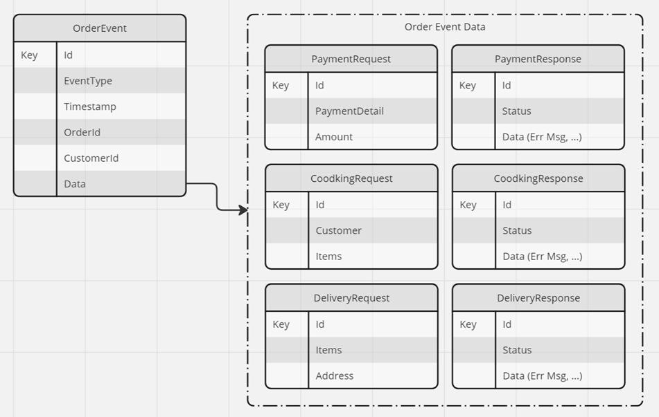

# Solution - Designing and Implementing Message based & Event Driven Apps

## Task: Examine the Domain Message Flow Model and Design the Message Data Structure

- Domain Message Flow Model

    

- Message Data Structure

    

## Task: Provision the required infrastructure

- Examine `deploy-app.azcli`

## Task: Implement the payment process  