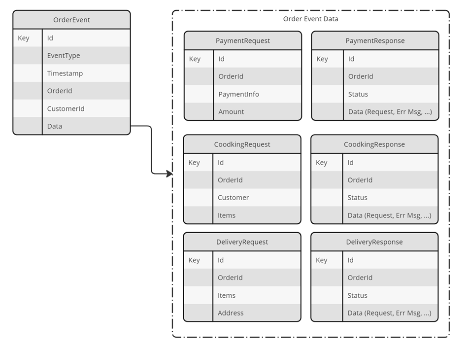

# Solution - Designing and Implementing Message based & Event Driven Apps

## Task: Examine the Domain Message Flow Model and Design the Message Data Structure

- Domain Message Flow Model

    

- Message Data Structure

    

## Task: Provision the required infrastructure

- Examine `deploy-app.azcli`

## Task: Implement the payment process  

In this task you will implement the payment process using some projects that you already know:

- [Order Service](./orders-service-cqrs/)
- [Order Event Processor](./order-events-processor/)
- [Payment Service](./payment-service-func/)

>Note: Payment Service is implemented as Durable Entity Function and is the outcome from [lab 4](../../lab-04/). It will be replaced be a Dapr Virtual Actor in the next lab.

Complete the following tasks:

- Refactor the Payment Service to be able to receive the following input:

    ```json
    {
        "id":"68a2849e-46d6-44ed-a5dc-ca22e8210e6e",
        "orderId":"ce911547-42e1-488c-8ea8-b1553ac8e20c",
        "customerId":"5",
        "eventType":"PaymentRequested",
        "data":"{
            \"orderId\":\"ce911547-42e1-488c-8ea8-b1553ac8e20c\",
            \"amount\":48.0,
            \"paymentInfo\": {
                \"name\":\"Marcela Tatra\",
                \"type\":\"Bank Transfer\",
                \"accountNumber\":\"9876\"
                }
        }",
        "timestamp":"2023-11-07T10:34:04.6723628Z"
    }
    ```

- Pass the input to a new static method `ExecutePayment` that executes the Payment against the `BankAccount` and returns a `PaymentResponse` wrapped in an `OrderEvent`.

    ```c#
    public static async Task<OrderEvent> ExecutePayment(string json, IDurableEntityClient client, ILogger logger){
        OrderEvent orderEvent = Newtonsoft.Json.JsonConvert.DeserializeObject<OrderEvent>(json);
        PaymentRequest paymentRequest = Newtonsoft.Json.JsonConvert.DeserializeObject<PaymentRequest>(orderEvent.Data.ToString());

        //Save the incoming payment request to the database - Omitted for brevity

        var entityId = new EntityId(nameof(BankAccount), paymentRequest.PaymentInfo.AccountNumber);
        EntityStateResponse<decimal> stateResponse = await client.ReadEntityStateAsync<decimal>(entityId);

        PaymentResponse paymentResponse = new PaymentResponse(){
            OrderId = paymentRequest.OrderId,
        };

        if(stateResponse.EntityExists)
        {
            if(stateResponse.EntityState >= paymentRequest.Amount)
            {
                await client.SignalEntityAsync(entityId, "withdraw", paymentRequest.Amount);
                paymentResponse.Status = "Success";
                paymentResponse.Data = paymentRequest;
            }
            else
            {
                var msg = $"Insufficient funds. Current balance: {stateResponse.EntityState}";
                paymentResponse.Status = "Failed";
                paymentResponse.Data = msg;
                logger.LogInformation(msg);
            }
        }
        else
        {
            var msg = $"Bank Account {entityId} does not exist.";
            paymentResponse.Status = "Failed";
            paymentResponse.Data = msg;
            logger.LogInformation(msg);
        }

        //Save the payment response to the database - Omitted for brevity
        OrderEvent result = new OrderEvent(){
            OrderId = paymentRequest.OrderId,
            EventType = "PaymentResponse",
            Data = paymentResponse
        };

        return result;
    }
    ```

- Test your implementation using the REST Client:

    ```bash
    POST {{paymentsUrl}}/api/bankAccount/processPayment
    content-type: application/json

    {
        "id":"68a2849e-46d6-44ed-a5dc-ca22e8210e6e",
        "orderId":"ce911547-42e1-488c-8ea8-b1553ac8e20c",
        "customerId":"5",
        "eventType":"PaymentRequested",
        "data":"{
            \"orderId\":\"ce911547-42e1-488c-8ea8-b1553ac8e20c\",
            \"amount\":48.0,
            \"paymentInfo\": {
                \"name\":\"Marcela Tatra\",
                \"type\":\"Bank Transfer\",
                \"accountNumber\":\"9876\"
                }
        }",
        "timestamp":"2023-11-07T10:34:04.6723628Z"
    }
    ```

- Add a new Function to the project that hast an Input Binding the Service Bus `payment-requests-queue` and an Output Binding to the `payment-response-queue`.

    ```c#
    public class HandlePaymentRequest
    {
        [FunctionName(nameof(HandlePaymentRequest))]
        [return: ServiceBus("payment-response", Connection = "ConnectionServiceBus")]
        public static async Task<OrderEvent> Run([ServiceBusTrigger("payment-requests", Connection = "ConnectionServiceBus")]string jsonPayment, 
        [DurableClient] IDurableEntityClient client, 
        ILogger logger)
        {
            logger.LogInformation($"C# ServiceBus queue trigger function processed message: {jsonPayment}");
            return await DurableBankAccount.ExecutePayment(jsonPayment, client, logger)
                .ConfigureAwait(false);
        }
    }
    ```