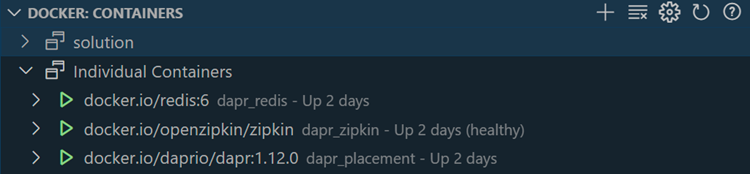
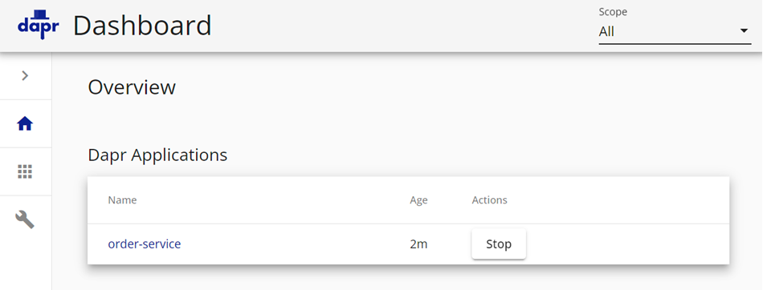
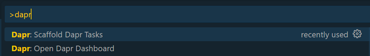
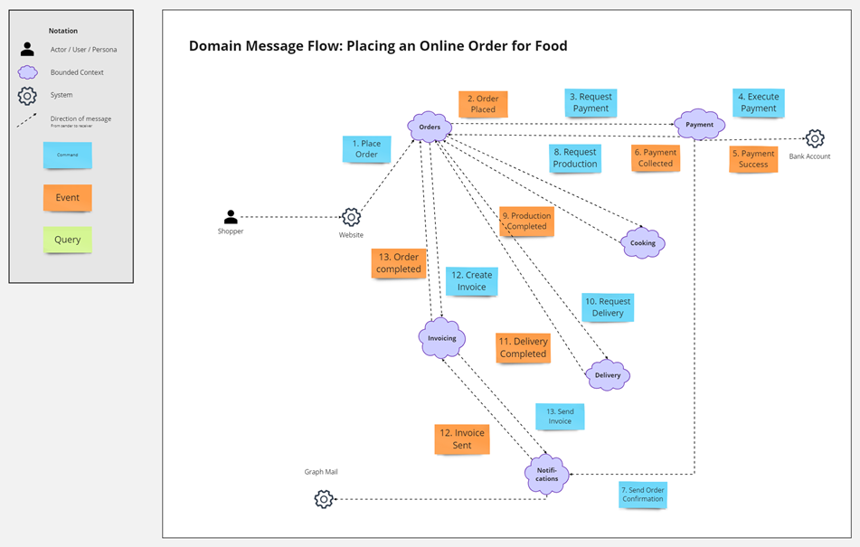
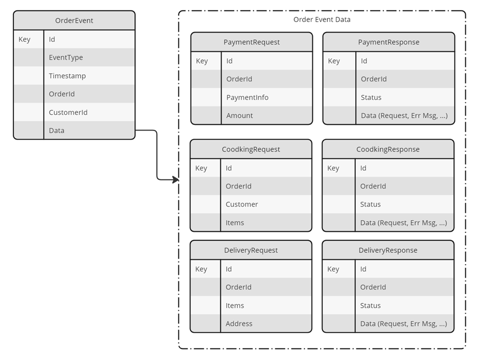

# Lab 07 - Using Distributed Application Runtime - Dapr

- Setup Developer Environment to support Dapr
- Provision the required infrastructure for Dapr Pub/Sub
- Get familiar with the starter projects
- Implement the payment process
- Publish to Azure Container Apps
- Cooking Service, Delivery Service - Optional


## Task: Setup Developer Environment to support Dapr

- Install Dapr CLI

    ```powershell
    Set-ExecutionPolicy RemoteSigned -scope CurrentUser
    powershell -Command "iwr -useb https://raw.githubusercontent.com/dapr/cli/master/install/install.ps1 | iex"
    ```

    >Note: Restart the terminal after installing the Dapr CLI

- Install the [Dapr Visual Studio Code extension](https://docs.dapr.io/developing-applications/local-development/ides/vscode/vscode-dapr-extension/)    

- Initialize default Dapr containers and check running containers:

    ```bash
    dapr init
    ```

    >Note: In case you need to remove the default Dapr containers run `dapr uninstall` 

- Check the running containers using the [Docker Visual Studio Code Extension](https://marketplace.visualstudio.com/items?itemName=ms-azuretools.vscode-docker)

    

- Run project [orders-service-cqrs](./starter/orders-service-cqrs/)

    ```bash
    dapr run --app-id order-service --app-port 5002 --dapr-http-port 5012 --resources-path './components' dotnet run
    ```
- Show Dapr Dashboard

    ```
    dapr dashboard
    ``` 

- Examine Dapr Dashboard on http://localhost:8080:

    

- Setup for Dapr Debugging can be done using the Dapr Extension for Visual Studio Code. 

    

    >Note: Make sure you have setup .NET debugging in advance

- Test your debug configuration

    

## Task: Provision the required infrastructure for Dapr Pub/Sub

- Create a new Azure Service Bus Namespace

    ```bash
    sbNS=aznativesb$env
    az servicebus namespace create --name <your-namespace-name> --resource-group <your-resource-group-name> --location <your-location> --sku Standard
    ```    

- Create the following Azure Service Bus topics using the following command:

    - payment-request
    - payment-response
    - cooking-request
    - cooking-response
    - delivery-request
    - delivery-response

    ```bash
    sbNS=aznativesb$env
    az servicebus topic create --name <your-topic-name> --namespace-name <your-namespace-name> --resource-group <your-resource-group-name>
    ```

## Task: Get familiar with the starter projects

- Examine the [starter projects](./starter/). Some of the projects we have used in previous labs, other are well prepared starters. All projects have the required Dapr components defined in the `<project>/components` folder. The required NuGet packages are already installed in all projects that require Dapr.

- To make local development and debug easier use the following ports reference for the services:

    | .NET Api Services         | Http Port | Https Port | Dapr Port | Dapr App ID          | Docker Port|
    | -------                   | --------- | ---------- | --------- | -------------        | -----|
    | Order Service             | 5002      | 5022       | 5012      | order-service        | 5052 |
    | Payment Service           | 5004      | 5024       | 5014      | payment-service      | 5054 |
    | Bank Actor Service        | 5005      | 5025       | 3500      | bank-actor           | 5055 |
    | Cooking Service           | 5006      | 5026       | 5016      | cooking-service      | 5056 |
    | Delivery Service          | 5007      | 5027       | 5017      | deliver-service      | 5057 |
    | Graph NotificationService | 5008      | 5028       | 5018      | notification-service | 5058 |

    
    | Azure Functions                 | Http Port | Docker Port|
    | -------                         | --------- | ---------- | 
    | Order Event Processor Function  | 7073      |            |

- Examine the `Food App Domain Message Flow`. 

        	

- Examine the `Food App Domain Message Flow`. 

    

## Task: Implement the payment process

- With this task we will implement the full Payment Process using Dapr Pub/Sub including the Bank Actor Service.

    

### Order Service  

- Add a configuration entry `PUBSUB_NAME` in `appsettings.json` and assign the value `food-pubsub`

- Open orders-service.csproj and ensure that Dapr related NuGet Packages are present. Also check the `components` folder for the Dapr PubSub components.

- Implement the `DaprEventBus` in `Infrastructure/DaprPubSub`:

    ```c#
    public class DaprEventBus : IDaprEventBus
    {
        private string DAPR_PUBSUB_NAME = "";
        private DaprClient daprClient;

        public DaprEventBus(DaprClient daprClient, IConfiguration config)
        {
            this.daprClient = daprClient;
            this.DAPR_PUBSUB_NAME = config.GetValue<string>("PUBSUB_NAME");
        }        

        public async void Publish(OrderEvent @event)        
        {
            string topicName = @event.EventType;
            await daprClient.PublishEventAsync(DAPR_PUBSUB_NAME, topicName, @event);         
        }
    }
    ```   

- Add the `IDaprEventBus` to `Program.cs`:

    ```c#
    // MediatR
    builder.Services.AddMediatR(cfg => cfg.RegisterServicesFromAssemblyContaining<Program>());

    // Dapr
    builder.Services.AddDaprClient();
    // Dapr Event Bus
    builder.Services.AddSingleton<IDaprEventBus, DaprEventBus>();

    // Controllers
    builder.Services.AddControllers();
    ```

- Update `OrdersController.cs` to inject the IDaprEventBus and assign it to a local variable

    ```c#
    public OrdersController(ISender sender,IDaprEventBus eventBus, AILogger aiLogger)
    {
        this.sender = sender;
        this.logger = aiLogger;
        this.eb = eventBus;
    }
    ```

- Update the `CreateOrderEvent` method in `OrdersController.cs`. After calling the command Handler insert the following code:

    ```c#
    var resp = await sender.Send(new CreateOrderEventCommand(order));

    var paymentRequest = new PaymentRequest
    {
        OrderId = order.Id,
        Amount = order.Total,
        PaymentInfo = order.Payment
    };

        // Wrap it into our Integration Event
    eb.Publish(new OrderEvent
    {
        OrderId = order.Id,
        CustomerId = order.Customer.Id,
        EventType = "PaymentRequested",
        Data = JsonConvert.SerializeObject(paymentRequest)
    });

    return resp;
    ```

- Run the Order Service and use the REST Client Tester to submit an order

    ```bash    
    dapr run --app-id order-service --app-port 5002 --dapr-http-port 5012 --resources-path './components' dotnet run
    ```

    >Note: If you need to debug your code be aware that a Dapr Debug configuration is already present in the project. 

### Payment Service

- Add a configuration entry `PUBSUB_NAME` in `appsettings.json` and assign the value `food-pubsub`

- Open payment-service.csproj and ensure that Dapr related NuGet Packages are present. Also check the `components` folder for the Dapr PubSub components.

- Register UseCloudEvents() and MapSubscribeHandler() in Program.cs to be able to participate in Dapr PubSub 

    ```c#
    // Register Dapr endpoints
    app.UseCloudEvents();
    app.MapControllers();
    app.MapSubscribeHandler();
    app.Run();
    ```

- We will use the existing `PaymentController.cs` to implement the Payment Service. Add the following code to the `AddPayment()-Method`:

    ```c#
    [HttpPost()]
    [Route("create")]
    [Dapr.Topic("food-pubsub", "payment-requested")]
    public async Task AddPayment(OrderEvent evt)
    {
        Console.WriteLine("Received payment request", evt.OrderId);
        ...
    }    
    ```

- Create the bank account and add some initial funding to it using the `BankController.cs` of the payment-service:

    ```c#
    [HttpPost("deposit")]
    public async Task<ActionResult> Deposit([FromBody] DepositRequest request)
    {
        var actor = ActorProxy.Create<IBankActor>(new ActorId(request.AccountId), "BankActor");
        await actor.SetupNewAccount(request.Amount);        
        return Ok();
    }
    ```

- Setup the bank account

    ```
    POST {{bankUrl}}/bankactor/deposit
    content-type: application/json

    {
        "accountid": "9876",
        "amount": 1000
    }
    ```
    
- Add the following code to `AddPayment()`:

    ```c#
    PaymentRequest paymentRequest = Newtonsoft.Json.JsonConvert.DeserializeObject<PaymentRequest>(evt.Data.ToString());
    if (paymentRequest != null)
    {
        // When using transactional Outbox pattern, we need to add the payment to the database
        // We then could use Cosmos Change feed to execute the payment against our dapr bank service
        // PaymentTransaction payment = new PaymentTransaction()
        // {
        //     Id = Guid.NewGuid().ToString(),
        //     CustomerId = evt.CustomerId,
        //     OrderId = paymentRequest.OrderId,
        //     PaymentInfo = paymentRequest.PaymentInfo,
        //     Amount = paymentRequest.Amount,
        //     Status = "Pending"
        // };            
        // await this.payment.AddPaymentAsync(payment);

        // To keep things simple we will just execute the payment against our dapr bank service
        var usersBank = ActorProxy.Create<IBankActor>(new ActorId(paymentRequest.PaymentInfo.AccountNumber), "BankActor");
        var withdrawResp = await usersBank.Withdraw(new WithdrawRequest() { Amount = paymentRequest.Amount });

        // Now we could issue a payment response just like we did in 
        PaymentResponse paymentResponse = new PaymentResponse()
        {
            OrderId = paymentRequest.OrderId,
            Status = withdrawResp.Status,
            Data = withdrawResp.Message
        };

        await daprClient.PublishEventAsync("food-pubsub", "payment-response", paymentResponse);
    }
    ```
- Run the Payment service and use the REST Client Tester to submit an order

    ```bash    
    dapr run --app-id payment-service --app-port 5004 --dapr-http-port 5014 --resources-path './components' dotnet run
    ```

- Submit an order using the REST Client Tester and check the console output of the Payment Service  

## Task: Publish to Azure Container Apps

- Use the result from [lab 03](../lab-03/solution/bicep/) as starter and add the missing services from this lab

- Add the following Dapr Components to the Container App Environment

    - State Store - Use [Azure Cosmos DB](https://docs.dapr.io/reference/components-reference/supported-state-stores/setup-azure-cosmosdb/)
    - PubSub - Use [Azure Service Bus Topics](https://docs.dapr.io/reference/components-reference/supported-pubsub/setup-azure-servicebus-topics/)

    >Note: You can use the [Demo](../../demos/07-dapr/02-statestore-aca/) as reference

- Publish the Order Service, Payment Service and Bank Actor Service to Azure Container Apps

## Task: Cooking Service, Delivery Service - Optional

- If your time permits you can repeat the pattern uses with the Payment Service for the Cooking Service, Delivery Service and Notification Service. We will extend the Cooking Service with the Cooking Dashboard Function later on

- Send the requests to the according service, wait for a few seconds and send a positive that will be consumed by the Order Service

- If you want you can also publish the Cooking Service and Delivery Service to Azure Container Apps